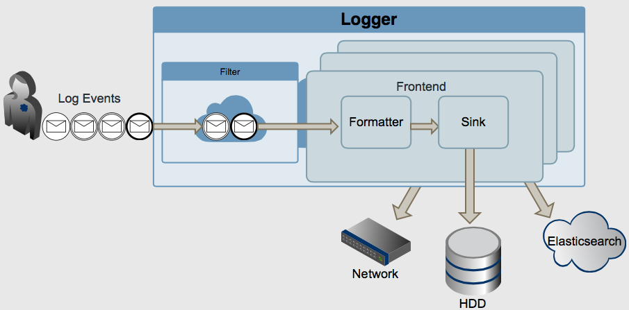

# Architecture

Blackhole was originally conceived as project with clearly separated entities, or modules. Mainly this decision was made because the project can be easily tested and expanded if it consists of independent entities than with the coupled ones.

Let's start our description with the fact that we represent Blackhole logger as the production line on which some cargos are transported and some work is done with them. This can be represented schematically as follows:

The main transport unit in our case - is log event.

Internally Blackhole events are mutual attributes container. Event is considered valid if there is at least one attribute in it. At this point let's talk what attributes are.

## Attributes

Nowadays logs are much more than just a message with attached timestamp and severity level and [Logstash](http://logstash.net)'s experience proves that. Of course that information provides a fairly comprehensive view about what’s going on and how important occurred event is, but the main problem that the event itself is completely unstructured and it's quite difficult to use in a further processing like extracting all logs with specific value in message.

Imagine that you are logging some http request. How do you form your logging event? Well, personally I'll write something like this:
    
    [2014-03-30 15:30:00.000000] [INFO]: GET '/index/type/id' failed with 404: document not found

Even there we can see additional log event's properties:

* HTTP method: GET
* URI: /index/type/id
* HTTP status code: 404
* HTTP error reason: document not found

See, even that simple log event can be typized (or structured) for further processing. What kind of processing? Well, are you seriously going to analyze your logs via parsing it with grep or other similar tool?

Not only it is inefficient, but also does not guarantee a positive result if the format changes with time. Much better is to put your events into special typed document-oriented database, like ElasticSearch which provides out of the box almost instantly search and analyze.

So, in Blackhole everything that relates to log event - is an attribute actually. Attribute itself is represented by value-scale pair, where value has variant type (which isn't sound very surprisingly for C++), and the scale determines attribute's mapping to one of the following groups:

* Local: user's attributes;
* Event: attributes, that doesn't specified by user, like message or timestamp;
* Global: logger's object specific attributes, which can be attached to the logger object and which are transported with it;
* Thread: thread-specific attributes, like thread id;
* Universe: program global attributes, like process id.

Also every attribute has its name, which in summary gives a complete picture of the log event.

## Log Event

Returning back to the log event, I repeat that log event - is just a set of typed attributes. In our case it will be:

    [timestamp: 2014-03-28 15:30:00.000000]
    [severity: 3]
    [message: request failed]
    [method: GET]
    [uri: /index/type/id]
    [status: 404]
    [reason: document not found]

All this attributes gives fully representation of event occurred. Moreover, it can be easily analyzed and indexed for further search.

Return to the consideration architecture scheme in more detail. We see, that all further manipulations with log events are occurred in logger object.

## Filtering

After sending attributes into logger object, they are pre-filtered. Since we have nothing but attributes in the log event, filtering performs on them. For example we can make filter, that only passes log events with severity level more than 3 (INFO) or by presence of some attribute (like urgent tag). Blackhole allows you to configure filtering in two ways: by specifying some functional object which accepts attributes set and returns boolean value, determining if the event pass filtering or not; or by using built-in filter DSL (will described later).

Filtered events are sent into the main part of logger - frontends, which can be one ore more.

## Frontend

Frontend consists of a simple pair of formatter-sink, and it is responsible for communication between them. If the standard contract between formatter and sink is not enough, you can always implement your own specialization of frontent's template class and use it. But it will be described later. For now we look at the each frontend's blocks: formatters and sinks.

### Formatter

Formatter module is responsible for translating log event into the string. Why string? Because for almost every case that you can imagine exactly string representation of log event is used.

* Writing log into files on the HDD? Definitely string!
* Syslog? Sure.
* NT events, sockets, streams? String again (event obfuscated or strongly formatted like jsoned, msgpacked or protobuffed string).

Thus, formatter's objects always produce strings.

Blackhole has some predefined formatters that we briefly enumerate. More detail description will be discussed later hereinafter:

* String by pattern: builds string by specified pattern using attributes provided;
* Json: builds completely json tree, custom tree structure is supported as like as custom nodes renaming; 
* Msgpack: behaves just like json formatter, but builds msgpacked object.

After formatting we have log event's string representation, and (we are almost done with it) the last thing we can do with that string - is to send it into the final destination appointment. It is the part where sinks comes at the first place.

### Sink

Sink module is responsible for final sending formatted message into its final destination. It can be file, socket, syslog or whatever else. At this moment some already implemented sinks are:

* Null: sends messages into, damn, nothing. Useful in testing;
* Stream: prints messages into standard outputs, like stdout or stderr;
* Files: sends messages into specified file. Multiple file handling are supported including file naming by pattern depending on log event's actual attributes. Also file rotation can be flexibly configured;
* Syslog: sends messages into \*nix syslog using standard glibc syslog interface functions. Facility, identity and other options can be also easily configured;
* Socket: sends message into specified UDP or TCP socket (synchronously at this time).

Here lifetime of log event ends.

## Repository.

Class apart is the repository singleton, which is responsible for the registration of all possible types of loggers that will be used in your application, adding typical configurations and, surprisingly, creating logger objects.

It should be considered just as a large factory.

[Back to contents](contents.md)