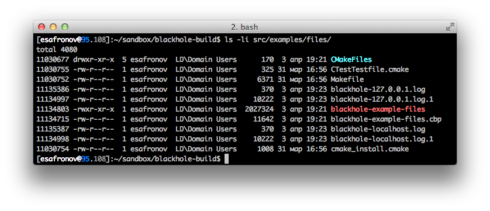
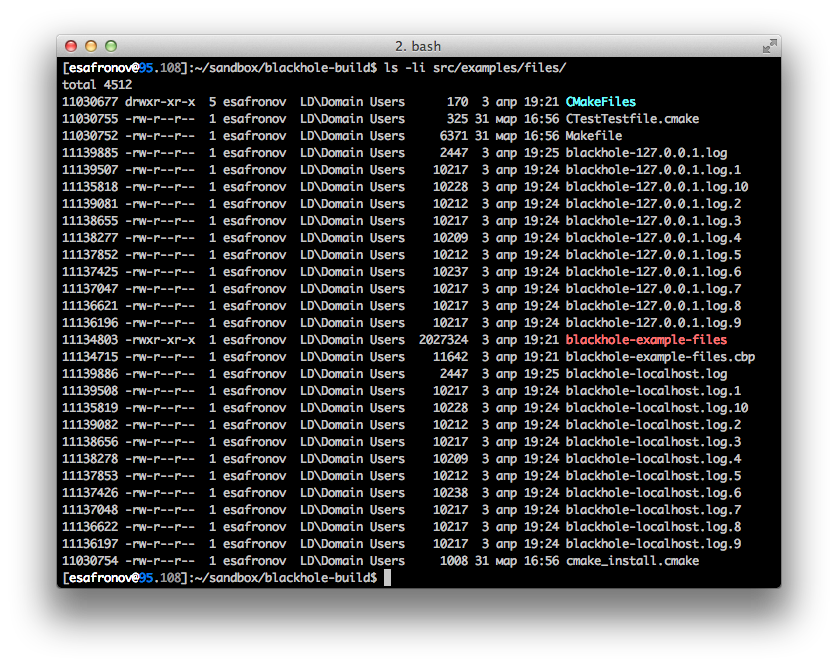
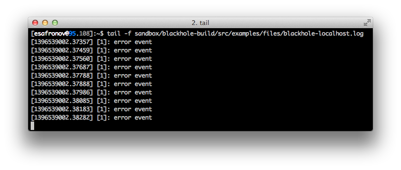

## How about write real logs?

This example is all about using file logger.
We consider how to register complex file sink with rotation support and how configure it to have multiple files which names will be chosen depending on log event attributes.
Then we will configure file rotation itself constrainted by file size and maximum backups. At last I'll show how to attach user attributes to every log message.

As always we started with included all necessary headers:

```
#include <blackhole/blackhole.hpp>
#include <blackhole/frontend/files.hpp>
```

Unlike previous examples there is new header file we needer - files frontend. If you look more deeper in the library you will see that there is also files sink located in

```
#include <blackhole/sink/files.hpp>
```

Why not to include it? Well, the need for special frontend is explained by fact, that files sink requires **additional** arguments in its *consume* method. In other words, files sink needs extended contract with underlying formatter. That's why frontends needed - to couple various formatters and sinks in one entity. If the existing contract doesn't satisfied with external requirements, there is always possibility to implement additional frontend specialization.

*Note, that there is also additional sink that requires extended frontend - syslog. More on syslog logging will be discussed later.*

Of course we need to define severity enumeration:

```
enum class level {
    debug,
    error
};

using namespace blackhole;
```

And here comes the most intresting part of this tutorial - frontend registration.

### Register everything

As formatter we choose string formatter, you should be already familiar with it. As sink it will be files sink with rotation support. Registration code may look frustrating and smells like dark template magic:

```
repository_t::instance().configure<
        sink::files_t<
            sink::files::boost_backend_t,
            sink::rotator_t<
                sink::files::boost_backend_t,
                sink::rotation::watcher::size_t
            >
        >,
        formatter::string_t
    >();
```

What? Why so complicated? To fully understand why I've made so strange architecture decision, let's look deeper inside the library.

Internally Blackhole has very few dynamicly coupled components. In other words, there are very few classes with *virtual* methods. That decision were made for two reasons.

The first one was an attempt to minimize virtual methods invocation overhead. Blackhole was initially planned as high-performance solution for logging and the main requirement was the fastest log processing .

The second reason was to have an ability to test separate components of the library, replacing others by mock-objects by the power of TDD. The alternative solution would require interface definition for every subcomponent. For example, files sink executes only basic operations with internal backend's interface and it is the backend who handles files itself. Also as a separate component of files sink there is so-called rotator, an interface which determines whether rotation should occur and which handles file rotation. 

To simplify the testing of all this zoo Alexandrescu's [Policy Based Design](http://en.wikipedia.org/wiki/Policy-based_design) was chosen, but it fits this case perfectly.

So, once again, Blackhole has very fwe dynamically coupled components. But they are there, and one of them - is **frontend**. Logger object itself operates with list of frontends and it doesn't care what logic it implements. This opens the possibility of creating frontend plugins and makes available to create extendable plugin system.

So why to register the components used statically? Some library components (formatters, sinks or frontends) can require additional properties or functions definition known at compile-time. For example, syslog sink requires the user to define mapping function that maps user defined severity level enumeration to the syslog's severity.

Just in case, repository's register method's signature is:

```
template<typename Level>
template<class Sink, class Formatter>
void repository_t<Level>::instance().configure();
```

Required logger's object can be properly created only after registering frontend with corresponding configuration. Without registration an exception will be thrown.

### Configuration comes

Returning to the formatters and sinks configuration, formatter one is already familiar to us:

```
formatter_config_t formatter("string");
formatter["pattern"] = "[%(timestamp)s] [%(severity)s]: %(message)s";
```

Files sink with rotation support configuration looks more intresting:

```
sink_config_t sink("files");
sink["path"] = "blackhole-%(host)s.log";
sink["autoflush"] = true;
sink["rotation"]["pattern"] = "%(filename)s.%N";
sink["rotation"]["backups"] = std::uint16_t(10);
sink["rotation"]["size"] = std::uint64_t(10 * 1024);
```

Although there is complete description in the reference documentation, let's stop on each option in detail.

#### Path
Path option determines (suddenly) file name where logs will be put.
In our case log records will be written in file named `blackhole-%...`

*What? What a placeholder?* 

Here we comes to the another Blackhole's feature: specifying file pattern or determining real file name depending on current log record's attributes set. [Logstash](logstash.net) has feature something like this, so if you familiar with Logstash, you'll be ok here. 

In our case there will be different files created with names depending on *host* attribute's value.

For example, if attribute `host: localhost`, then all logs having host attribute in its records 'localhost' will be written into file named `blackhole-localhost.log`. If there won't be this attribute, nothing will be substituted leaving raw placeholder in its place. 

Using placeholders is not necessary, so if you want to write all logs in one file (say, blackhole.log), just don't use them.

#### Autoflush
Autoflush determines whether logs are dumped in the file immediately, or accumulated in the internal buffer.

#### Rotation
Here come several rotation options, that determines file rotation settings. If something defined in this section, Blackhole will create files sink with rotation support, otherwise without one.

* Option `pattern` specifies pattern for backup files. Any name can be used here, if you want to keep your backup names differently than the active file name. For convenience the next placeholders can be also used:        

    * Filename `%(filename)s` placeholder substitutes active file name.
    * Positional `%N` placeholder substitutes current backup position, starting with 1.
    * Date-time placeholders `%Y`, `%H`, `%M` etc. substitute the current values ​​of the corresponding fields.
* Option `backups` specifies maximum backup count. After reaching that value older files will be replaced with the newer ones.
* Option `size` specifies active file's maximum size, after reacting that it will be rotated.

*Note that also date-time rotation can be specified, e.g. each day or each hour, but not now. More detailed it will be discussed in reference documentation.*

In our example we just customized our files sink so that it will rotate files after reaching 10 KB size, also there will be maximum 10 backups.

Next steps should be already familiar for people who passes previous tutorials. We just create frontend and logger configuration objects and push the last one into the repository.

```
frontend_config_t frontend = { formatter, sink };
log_config_t config{ "root", { frontend } };

repository_t::instance().add_config(config);
```

### How to use this stuff
All that remains is to create `main` function. It isn't contains almost nothing new for us, so I just leave its code here:

```
int main(int, char**) {
    init();
    verbose_logger_t<level> log = repository_t::instance().root<level>();

    for (int i = 0; i < 32; ++i) {
        BH_LOG(log, level::debug, "debug event")("host", "127.0.0.1");
        BH_LOG(log, level::error, "error event")("host", "localhost");
    }

    return 0;
}
```

We just writing logs in cycle 32 times (to accelerate rotation condition to see how it works). However there are differences. Are you notices that braces with two parameters after each log macro? *Seems like something called after invoking logging macro.*

Welcome to the **dynamic attributes** setting into the log event! Every log event can transport any number of additional attributes, which will participate in all subsequent operations associated with it (look at the architecture diagram, if you forgot).

How is it imlemented?

Actually, `BH_LOG` macro returns functional object, which accepts variadic pack that is analizyd in four ways.

**First** way is to explicitly create attributes objects using helper `attributes::make` function:

```
BH_LOG(log, level::debug, "debug event")(
    attribute::make("host", "localhost"),
    attribute::make("answer", 42.0),
    attribute::make("code", 404)
);
```

**Additionly** you can use registered **keywords**:
```
BH_LOG(log, level::debug, "debug event")(
    keyword::host() = "localhost",
    keyword::answer() = 42.0,
    keyword::code() = 404
);
```

In fact it is syntactic sugar over the first method. Registered keywords have defined `operator=`, which returns attribute object therefore the first and the second method can be combined:

```
BH_LOG(log, level::debug, "debug event")(
    attribute::make("host", "localhost"),
    keyword::answer() = 42.0,
    attribute::make("code", 404)
);
```

Keywords can be useful not only for these purposes. More details about them will be discussed in reference documentation.

The **third** method is relatively recent. It allows you to specify a list of attributes as key-value pairs, where the key should be converted string and value - should be implicitly converted to `attribute_value_t`. In code, it looks like this:
```
BH_LOG(log, level::debug, "debug event")(
    "host", "localhost",
    "answer", 42.0,
    "code", 404
);
```

Argument correctness is verified at compile time, so if something goes wrong will be given a human-readable `static_assert`.

The **fourth** way involves initialization lists usage, which gives for some people more clean code:

```
BH_LOG(log, level::debug, "debug event")(attribute::list({
    {"host", "localhost"},
    {"answer", 42.0},
    {"code", 404}
}));
```

*Note, that some compilers allows you not to specify `attribute::list` type explicitly. For example:*

```
BH_LOG(log, level::debug, "debug event")({
    {"host", "localhost"},
    {"answer", 42.0},
    {"code", 404}
});
```

*Actually, only GCC 4.6 doesn't allow you to write like this, because it violates the C++11 Standard (see '-fno-deduce-init-list' extension for more details).*

Which of the following methods to choose - is your decision, depending on what you prefer.

Full example code:

```
#include <blackhole/blackhole.hpp>
#include <blackhole/frontend/files.hpp>

using namespace blackhole;

enum class level {
    debug,
    error
};

void init() {
    repository_t::instance().configure<
        sink::files_t<
            sink::files::boost_backend_t,
            sink::rotator_t<
                sink::files::boost_backend_t,
                sink::rotation::watcher::size_t
            >
        >,
        formatter::string_t
    >();

    formatter_config_t formatter("string");
    formatter["pattern"] = "[%(timestamp)s] [%(severity)s]: %(message)s";

    sink_config_t sink("files");
    sink["path"] = "blackhole-%(host)s.log";
    sink["autoflush"] = true;
    sink["rotation"]["pattern"] = "%(filename)s.%N";
    sink["rotation"]["backups"] = std::uint16_t(10);
    sink["rotation"]["size"] = std::uint64_t(10 * 1024);

    frontend_config_t frontend = { formatter, sink };
    log_config_t config{ "root", { frontend } };

    repository_t::instance().add_config(config);
}

int main(int, char**) {
    init();
    verbose_logger_t<level> log = repository_t::instance().root<level>();

    for (int i = 0; i < 32; ++i) {
        BH_LOG(log, level::debug, "debug event")("host", "127.0.0.1");
        BH_LOG(log, level::error, "error event")("host", "localhost");
    }

    return 0;
}
```

By running this example several times rotation effect can be tracked.

Just after first rotation:


After collecting maximum backups:


Althought not covered here it's also worth mentioning that files can be also rotated, say, every day or every hour. To mark date and time when rotattion occurs, special datetime placeholders can be used in file pattern.

Instead of conclusions note that Blackhole provides wide support of file logging including rotating, naming and complex formatting. For this example, resulted file will look like:
