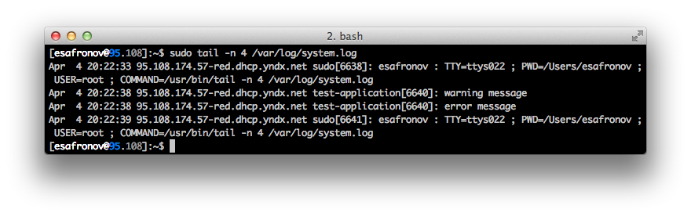

# `Syslog`-sink
It writes log messages to \*nix syslog.

`syslog`-sink is thread-safe.

The first you need to do is to include special header:

```
#include <blackhole/frontend/syslog.hpp>
```

##Registration
You should register this sink before use. To do it include the following code into your program:

```
repository_t::instance().configure<sink::syslog_t<level>, formatter::string_t>();
```

The code above register `syslog`-sink and `string`-formatter pair. How to register another combinations of sinks and formatters check the ["Registration rules" article](registration-rules.md).

After the registration this pair can be configured and used.

##Configuration

Example:

```
sink_config_t sink("syslog");
sink["identity"] = "test-application";
```

`identity` is an app name that \*nix syslog needs.

###Severity levels
As usual you need to define severity levels for app. For example:

```
enum class level {
    debug,
    warning,
    error
};
```

The fact that syslog has own severity level definition as it described in **RFC5424** and we need to properly map from user defined severity enumeration to the syslog's one. But there is no other way to pass additional parameter (current log event's severity) to the sink except implementing frontend's template specialization. That's why we need additional header file.

Okay, now we know that it is necessary to map severity levels, but how to do that? Blackhole provides you way to do that via implementing additional template specialization. The code will looks like this:

```
namespace blackhole {

namespace sink {

template<>
struct priority_traits<level> {
    static priority_t map(level lvl) {
        switch (lvl) {
        case level::debug:
            return priority_t::debug;
        case level::warning:
            return priority_t::warning;
        case level::error:
            return priority_t::err;
        default:
            return priority_t::debug;
        }

        return priority_t::debug;
    }
};

} // namespace sink

} // namespace blackhole
```

We just implement `priority_traits` template specialization with single static method `map` that accepts single parameter - user-defined severity (`level` in our case) and returns syslog's one - `priority_t`. Mapping itself is a user's responsibility.


##Example

```
#include <blackhole/blackhole.hpp>
#include <blackhole/frontend/syslog.hpp>

//! This example demonstrates how to configure syslog sink and its features.
//!  - mapping from user-defined severity to the syslog's one.

enum class level {
    debug,
    warning,
    error
};

// To be able to properly map user-defined severity enumeration to the syslog's one
// we should implement special mapping trait that is called by library each time when
// mapping is required.
namespace blackhole {

namespace sink {

template<>
struct priority_traits<level> {
    static priority_t map(level lvl) {
        switch (lvl) {
        case level::debug:
            return priority_t::debug;
        case level::warning:
            return priority_t::warning;
        case level::error:
            return priority_t::err;
        default:
            return priority_t::debug;
        }

        return priority_t::debug;
    }
};

} // namespace sink

} // namespace blackhole

using namespace blackhole;

// Here we are going to configure our string/syslog frontend and to register it.
void init() {
    // As always register necessary formatter and sink. Note that syslog sink requires
    // user-defined severity enumeration symbol as template parameter.
    // This information is needed for severity level mapping.
    repository_t::instance().configure<sink::syslog_t<level>, formatter::string_t>();

    // Formatter is configured as usual, except we don't need anything than message.
    formatter_config_t formatter("string");
    formatter["pattern"] = "%(message)s";

    // Syslog sink in its current implementation also hasn't large amout of options.
    sink_config_t sink("syslog");
    sink["identity"] = "test-application";

    frontend_config_t frontend = { formatter, sink };
    log_config_t config{ "syslog_string", { frontend } };

    repository_t::instance().add_config(config);
}

int main(int, char**) {
    init();
    verbose_logger_t<level> log = repository_t::instance().create<level>("syslog_string");

    BH_LOG(log, level::debug, "debug message");
    BH_LOG(log, level::warning, "warning message");
    BH_LOG(log, level::error, "error message");

    return 0;
}
```

Compile and run it:

```
$ g++ syslog.cpp -osyslog-string-sink -std=c++0x -lboost_thread-mt
$ ./syslog-string-sink
```

After executing the next messages should be displayed in your syslog (depending on your syslog's configuration):


*Note that debug message in this case was ignored by syslog itself, not by Blackhole.*

[Back to contents](contents.md)